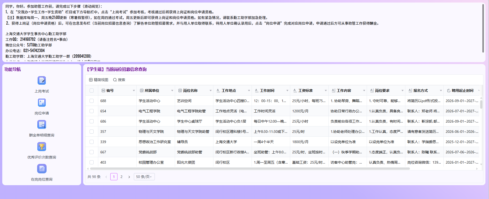
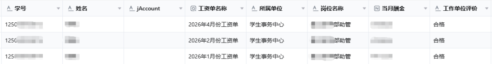

## 概述

**勤工助学**是学校学生资助工作的重要组成部分，是提高学生综合素质和资助家庭经济困难学生的有效途径，是实现全程育人、全方位育人的有效平台。校内勤工助学分为助管、助教助研。校外勤工助学主要渠道有兼职和家教。相关政策请见[学生事务中心说明](https://affairs.sjtu.edu.cn/index.php?m=app&v=fundinghall&mid=42)。

勤工助学活动应坚持“立足校园、服务社会”的宗旨，按照学有余力、自愿申请、信息公开、扶困优先、竞争上岗、遵纪守法的原则，由学校在不影响正常教学秩序和学生正常学习的前提下有组织地开展。

勤工助学活动是指学生在学校的组织下利用课余时间，通过劳动取得合法报酬，用于改善学习和生活条件的实践活动，由学校统一组织和管理。

学生参加勤工助学的时间**原则上每周不超过8小时，每月不超过40小时**，寒暑假勤工助学时间可根据学校的具体情况适当延长。同时，学生事务中心会结合上海市大学生消费水平等因素控制学生参加校内勤工助学的总工时数和总酬金。原则上**学生辅导员、行政管培生等固定岗位不再同时兼任其他校内行政管理助理类固定岗位工作**。

**[上海交通大学学生事务中心](https://affairs.sjtu.edu.cn/)负责勤工助学的日常管理工作**。具体负责加强对勤工助学学生的思想教育，确定校内校内勤工助学岗位，引导和组织学生积极参加勤工助学活动，指导和监督学生的勤工助学活动等。同时，学生事务中心依托学生勤工助学团队，**设置[勤工助学部](https://affairs.sjtu.edu.cn/index.php?m=app&v=aboutus&mid=65)，面向学生进行朋辈互助服务**。

学生事务中心官网链接：

- [《上海交通大学勤工助学管理办法》](https://affairs.sjtu.edu.cn/index.php?m=app&v=fundinghall&mid=42)
- [勤工助学常见问题](https://affairs.sjtu.edu.cn/index.php?m=app&v=fundinghall&mid=41)

### 联系方式

勤工助学部：

- 微信公众号：sjtuqgzxb
- 值班地点：闵行校区学生中心大楼一楼3号工位
- 值班时间：工作日周一至周五 8:30-17:30（寒暑假值班时间参考“上海交通大学学生事务中心”微信公众号发布的业务办理指南推送）
- 部门QQ：214160792
- 联系电话：021-54742304

## 助管

管理助理，简称“助管”。2025年起，勤工助学新系统正式启用。点击[网页端](https://ssc.sjtu.edu.cn/dashboard/38acfb19/view)，或“交我办”APP搜索“勤工助学岗位申请”进行访问。

助管上岗整体流程：
1. 完成[勤工助学上岗考试](#上岗考试)，获得上岗证；
2. 查看[勤工助学岗位信息](#岗位信息查看)并联系招募单位；
3. 达成意向后，在系统进行[勤工助学岗位申请](#岗位申请)；
4. 上岗工作，[查询酬金](#酬金查询)。

### 上岗考试

进入[勤工助学系统](https://ssc.sjtu.edu.cn/dashboard/38acfb19/view)后，点击 **【上岗考试】** 进入考试页面，也可在“交我办”APP直接搜索 **“勤工助学上岗考试”**。

上岗考试内容以《勤工助学管理办法》和《勤工助学部介绍》为主，可在“SJTU勤工助学部”公众号菜单栏 “学习内容” 板块进行学习。

请注意，上岗考试**80分及以上**视为通过，通过后即可进行岗位申请。

若累计5次未通过上岗考试，需联系勤工助学部QQ214160792或电话021-54742304。

### 岗位信息查看

进入[勤工助学系统](https://ssc.sjtu.edu.cn/dashboard/38acfb19/view)，或“交我办”APP搜索“勤工助学岗位申请”，在主界面查看“【学生端】当前岗位招募信息查询”板块，点击可查看岗位详细信息、具体工作要求、报名方式等内容，支持各字段检索功能，学生可根据各岗位要求报名渠道与设岗单位进行联络与沟通。

Q：单位老师说已经在勤工助学平台发布了岗位，为什么我无法看到？

A：老师发布的岗位可能还未审核通过或者该岗位超过发布有效期已经被隐藏，可联系单位老师直接将“申请岗位截止时间”延长即可。

### 岗位申请

> 进行岗位申请前，需先通过勤工助学上岗考试，否则无法进行申请。本校直升无需重新登记上岗证/进行岗位申请。

获得录取资格后，需根据各岗位要求在系统进行勤工助学岗位申请，在系统中点击【岗位申请】进入岗位申请页面。

在页面中填写手机号，选择聘用单位老师告知的“岗位所属单位”和“岗位名称”，提交后等待单位老师审核通过即视为成功上岗。

如需查询现在自己被哪些校内岗位录取，可以在勤工助学系统【在岗岗位查询】模块点击查看。

### 酬金查询

各用人单位一般在**每月20号前**提交酬金单，当月提交并审核通过后，酬金将于**下月3号发至与学号绑定的中国银行卡**中，寒暑假工作一般顺延至下月合并发放，特殊情况除外。

在系统中点击【酬金单明细查询】即可查询本人**2026年1月份及之后**获得的酬金。

酬金查询页面如下图所示，如无当月酬金数据，请联系用人单位负责老师。

**研究生**如酬金查询页面有数据，可登录财务计划处系统查询明细，进行二次确认，其中“管理助教”一栏为研究生助管收到的酬金明细类目。如两个系统都有数据，但仍未收到钱，需检查自己的银行卡状态。

银行卡相关问题自查：

- **未办理中国银行借记卡**：先去中国银行网点办理（就近即可），参考校区网点：闵行校区（第四餐饮大楼南侧），徐汇校区（广元西路45号）。
- **有中国银行借记卡，但没有在系统中和学号绑定**：绑定路径为【财务系统-事项申请-我要申请-银行卡维护-关联中行借记卡】。
- **绑定了银行卡但仍没有收到钱**：
  - **卡号无效（证件过期、六个月内无交易）**：应携带身份证去中国银行网点更新个人信息。
  - **卡关闭（销户）**：去中国银行网点办理新的银行卡并按上述绑定路径提交信息。
  - **转入新账户出错（账号信息有误、备案的非中国银行卡）**：检查银行卡信息并按上述绑定路径重新绑定登记。

### 优秀评价次数查询

校内每个勤工助学聘用单位均有评选月度优秀助管的资格，优秀助管人数不超过部门助管人数的10%，如部门不满10人则无法评选。

在系统中点击 **【优秀评价次数查询】** 进入查询页面，在页面左侧输入自己的【学号】后即可查询。

若累计获得的优秀评价次数达到**10次**（若此前已兑换过奖励，则以系统中“领取优秀助管奖励后的剩余次数”显示的数据为准），即可凭思源码前往闵行校区学生中心一楼3号窗口办理优秀助管登记，经审核通过后，将颁发优秀助管证书并发放奖金（上半月登记一般次月3号发放，下半月登记一般隔月3号发放）。

### 校内岗位发布

校内单位如需发布助管招募信息，请联系官方QQ214160792，并按照部门所提供的方式进行发布。

信息来源：
- [勤工助学部公众号文章【全新升级｜学生勤工助学系统上线通知】](https://mp.weixin.qq.com/s/fPS6cNRqMYnpbkczxxFgCQ)
- [勤工助学部公众号文章【勤工助学常见问题Q&A】](https://mp.weixin.qq.com/s/ICk8TzrT6V9uYqNPCIuAmQ)

## 助教
教学助理，简称“助教”。助教仅限研究生担任（除致远学院和浦江国际学院）。

担任助教应先完成教育发展中心每学期组织的[助教培训](https://ctld.sjtu.edu.cn/service/teacher_assistant?id=10)并获得“上海交通大学研究生助教培训考核电子证书”，随后可在“交我办-学生工作-研究生助教申请”申请助教。

助教岗位的信息也可以关注学院群的通知，或直接联系课程教师。

| 助教业务                   | 负责教师联系方式                                             |
| -------------------------- | ------------------------------------------------------------ |
| 助教培训、卓越助教评选     | 教学发展中心 徐倩云老师 34207648-8004 xuqianyun@sjtu.edu.cn |
| 助教证书查询               | 研究生院 王辰悦老师 chenyue_wang@sjtu.edu.cn            |
| 岗位聘用                   | 所在学院或聘用单位负责助教工作的老师                         |
| 助教考核（本科生通识课）   | 教务处 王瑶琳老师 411291962@sjtu.edu.cn                 |
| 助教考核（本科生其他课程） | 所在学院或聘用单位负责助教工作的老师                         |
| 助教考核（研究生课程）     | 研究生院 王辰悦老师 chenyue_wang@sjtu.edu.cn            |
| 工资发放                   | 学生事务中心 王祎老师 misaki@sjtu.edu.cn                |

## 助研

科研助理，简称“助研”。各学院和课题组会发布相关招聘启事。